# AI Coding Assistant: The "Senior Engineer" Framework

Welcome to the **AI Coding Framework**. This repository contains a rigorous set of directives and standards designed to turn any Large Language Model (LLM) into a generic, **Spec-Driven** and **State-Aware** Senior Software Engineer.

This framework solves the common problems of AI coding: **Amnesia** (forgetting context), **Hallucination** (guessing), **Vibe Coding** (lack of specs), and **Monolithic Code** (bad architecture).

---

## 🚀 Quick Start for Users

### 1. Setup a New Project
To "hydrate" a new project with this brain, copy these files into your project root:
*   `coding/AI_CODING_DIRECTIVES.md` (The Brain - v3)
*   `coding/CODING_STANDARDS.md` (The Law - v3)
*   `coding/PROJECT_LEARNINGS_TEMPLATE.md` (The Memory Seed)
*   `coding/templates/` (The Tools)

### 2. How to Prompt the AI
To get the best results, simply remind the AI of its identity at the start of a session:

> "You are an AI Architect. Follow the directives in `@coding/AI_CODING_DIRECTIVES.md`."

### 3. The Workflow You Will See
Don't be alarmed if the AI doesn't start coding immediately. It is following a strict **Spec-Driven** protocol:

1.  **Context Loading:** It reads `.context/active_state.md`.
2.  **Spec Loop:** For complex tasks, it will draft/update `docs/specs/` (Product, Tech, Requirements, Tasks).
3.  **Consensus Gate:** It will present a **Plan Summary** and **WAIT** for your approval.
4.  **Stop-and-Wait Execution:** It implements one task from `docs/specs/tasks.md` at a time.
5.  **Drift Detection:** It ensures code matches the Spec.
6.  **Epilogue:** It updates Docs, Changelog, and Learnings before quitting.

## 🔄 Interaction Diagram

```mermaid
sequenceDiagram
    participant User
    participant AI as AI Architect
    participant State as .context/active_state.md
    participant Specs as docs/specs/

    User->>AI: Prompt ("Build Feature X")
    
    rect rgb(30, 30, 30)
    Note right of AI: Phase 0: Context
    AI->>State: Read State & Constraints
    end

    alt Simple Task (< 1 hr)
        AI->>User: Execute & Answer (Escape Hatch)
    else Complex Task
        rect rgb(20, 50, 80)
        Note right of AI: Phase 1: Blueprint
        AI->>Specs: Draft/Update Specs (Product, Tech, Req)
        AI->>Specs: Create tasks.md (Execution Plan)
        AI->>User: 🛑 Plan Summary & Request Approval
        end
        
        User->>AI: "Proceed" (Consensus Gate)

        loop Phase 2: Stop-and-Wait
            AI->>Specs: Read Next Task from tasks.md
            AI->>AI: Implement Atomic Unit
            AI->>AI: Verify (Tests)
            AI->>State: Update Progress
            AI->>User: "Task Complete. Continue?"
            User->>AI: "Continue"
        end

        rect rgb(20, 80, 20)
        Note right of AI: Phase 4: Epilogue
        AI->>Specs: Drift Detection (Code vs Spec)
        AI->>State: Archive State & Update Learnings
        AI->>User: "Session Closed."
        end
    end
```



---

## 🧠 The Core Components

### 1. `AI_CODING_DIRECTIVES.md` (The Process)
This is the operating system (v3). It enforces:
*   **Spec-Driven Development (SDD):** No code is written without a persistent "Source of Truth" in `docs/specs/`.
*   **First Principles:** Forces the AI to decompose problems into pure logic ("Atomic Units") before writing any I/O code.
*   **State Management:** Uses `.context/active_state.md` to track progress across sessions.
*   **Consensus Gate:** Forces the AI to stop and validate the plan with the user before implementation.

### 2. `CODING_STANDARDS.md` (The Quality)
This defines the syntax rules.
*   **EARS Syntax:** Requirements must use "When... Then..." syntax to reduce ambiguity.
*   **Visual Architecture:** Complex flows require Mermaid.js diagrams.
*   **Two-Tiered Testing:** Strictly separates Unit Tests (fast, mocked) from Contract Tests (boundaries).

### 3. `PROJECT_LEARNINGS.md` (The Wisdom)
This file gets smarter over time. It captures:
*   **Invariants:** Rules that must never be broken.
*   **Patterns:** Solutions that worked.
*   **Anti-Patterns:** Approaches that failed.

### 4. `coding/templates/` (The Tools)
Standardized artifacts that ensure Spec-Driven Development (SDD):
*   **`spec_product.md`:** Defines the "Why" (User Persona) and "Anti-Goals".
*   **`spec_tech.md`:** Pins the Tech Stack and forbids specific libraries.
*   **`spec_requirements.md`:** Forces logical clarity using **EARS** syntax.
*   **`spec_tasks.md`:** A gated checklist for the "Stop-and-Wait" protocol.

---

## 📂 Directory Structure

The framework expects this structure:

```text
.context/
├── active_state.md      # The "Hot" context (Current Task)
├── handover.md          # The "Baton" (Summary for next session)
└── history/             # Archived states (Audit trail)

docs/
├── specs/               # The Source of Truth (SDD)
│   ├── product.md       # The "Why" & "Vibe"
│   ├── tech.md          # The Constraints
│   ├── requirements.md  # The "What" (EARS Syntax)
│   ├── design.md        # The Visuals (Mermaid)
│   └── tasks.md         # The Plan
├── DECISION_LOG.md      # Architectural Decisions

coding/
├── templates/           # Standard templates for specs & state
├── AI_CODING_DIRECTIVES.md
└── PROJECT_LEARNINGS_TEMPLATE.md
```

---

## ⚡ Pro-Tips for the User

*   **The "Escape Hatch":** If you just want to ask "How do I list files?", the AI knows to skip the heavy process. Just ask.
*   **The "Consensus Gate":** The AI will **STOP** after planning. You must explicitly say "Proceed" or "Approved" to start coding.
*   **The "Epilogue":** If the AI says "I'm done" but hasn't updated the docs, just type: **"Execute Epilogue."**
*   **Debug Loop:** If the AI gets stuck, it will enter the **OODA Loop** (Observe, Orient, Decide, Act). It will ask you to run commands to gather evidence. **Run them.**

---

## 🛑 The "Golden Rules" (For the AI)

1.  **Update State:** If it's not in `.context/active_state.md`, it didn't happen.
2.  **Follow the Spec:** Code must match `docs/specs/requirements.md`.
3.  **Telegraphic Context:** Internal notes should be caveman-style ("Server crash. Retry fail.").
4.  **Professional Docs:** Public docs must be Shakespearean.