# Anamnesis

> A stateful, spec-driven framework for AI-assisted software engineering.

This framework solves the core problems of AI-assisted coding: **Amnesia** (forgetting context), **Hallucination** (guessing), **Vibe Coding** (lack of specs), and **Monolithic Code** (bad architecture).

---

## 🚀 Quick Start (Zero-Friction)

> **🤖 For AI Agents:** If you have been tasked with updating the Anamnesis framework in your current environment, please read and follow the instructions in the [INITIATOR.md](https://github.com/Skeptomenos/Anamnesis/blob/main/anamnesis_starter/INITIATOR.md) file of this repository. It contains the logic for structural migration, template syncing, and protocol updates.

### 1. Copy the Initiator
Copy `INITIATOR.md` from this repository to your project root.

### 2. Run the Wizard
Ask your AI: **"Initialize Anamnesis"** or **"Update Anamnesis"**.

The AI will guide you through:
- **New Projects:** Design thinking, ideation, and MVP scoping.
- **Existing Projects:** Intelligent retrofit with source attribution and architecture mapping.
- **Updates:** Seamless migration to the latest framework version using Shadow Files.

---

## 🔄 The Workflow You Will See

Don't be alarmed if the AI doesn't start coding immediately. It follows a **Thinking → Execution → Epilogue** protocol:

1. **Context:** Loads state from `project/` and constraints from `PROJECT_LEARNINGS.md`.
2. **Thinking:** For complex tasks, enters First Principles mode—decomposes the problem, runs Elimination Test, explores options.
3. **Consensus Gate:** Presents a **Plan Summary** and **WAITS** for your approval before any code. (Handshake Rule applies: No plan+code in same turn).
4. **Execution:** Implements tasks one-by-one from `project/tasks.md`, with OODA debugging if stuck.
5. **Epilogue:** Reflects on session (T-RFL), distills learnings, archives state.

---

## 🔄 Interaction Diagram

```mermaid
sequenceDiagram
    participant User
    participant AI as AI Agent
    participant Context as project/
    participant Specs as anamnesis/specs/

    User->>AI: Request

    rect rgb(40, 40, 40)
    Note right of AI: CONTEXT
    AI->>Context: Load state & constraints
    end

    alt Simple Task
        AI->>User: Answer (Escape Hatch)
    else Complex Task
        rect rgb(60, 30, 70)
        Note right of AI: THINKING
        AI->>AI: First Principles & Elimination Test
        AI->>Specs: Draft problem.md, options.md
        AI->>User: 🛑 Consensus Gate - WAIT
        end
        
        User->>AI: Approved

        rect rgb(30, 50, 80)
        Note right of AI: EXECUTION
        loop Task by Task
            AI->>Specs: Read → Build → Test → Mark Done
            opt 3+ Failures
                AI-->>AI: OODA Stop-Gap (may return to Thinking)
            end
        end
        end

        rect rgb(30, 70, 40)
        Note right of AI: EPILOGUE (Reflect)
        AI->>AI: T-RFL: Synthesize learnings
        AI->>Context: Archive state, handover
        AI->>User: Session complete
        end
    end
```



---

## 📚 Progressive Disclosure Architecture

The framework uses a **Progressive Disclosure** pattern to optimize AI context usage:


| **Root** | `AGENTS.md` | Always (auto-loaded) | Essential context, golden rules, pointers |
| **Thinking** | `anamnesis/directives/THINKING.core.md` | New ideas, features, refactors, complex bugs | First Principles & Design Thinking |
| **Execution** | `anamnesis/directives/EXECUTION.core.md` | Implementation tasks | Build, test, deliver protocols |
| **Quality** | `anamnesis/standards/INDEX.md` | Code writing | Style and quality rules |
| **Wisdom** | `PROJECT_LEARNINGS.md` | Every session | Project-specific constraints |

**Why?** LLMs have limited instruction-following capacity (~150-200 instructions). The slim root file (~70 lines) provides essential context, and detailed protocols are read only when needed. The separation of Thinking and Execution allows different cognitive modes for different tasks.

---

## 🧠 The Core Components


### 1. `THINKING.core.md` (The Mind)

This guides problem decomposition BEFORE implementation (v4.4):
- **Shadow Files:** Separates framework logic (`.core`) from user logic (`.custom`).
- **First Principles:** Strip problems to fundamental truths before building solutions.
- **Design Thinking:** Understand users, define problems clearly, explore options.
- **Root Cause Analysis:** Structured debugging for complex bugs.
- **Consensus Gate:** Present thinking summary and WAIT for user validation.

### 2. `EXECUTION.core.md` (The Hands)

This guides implementation AFTER thinking is complete (v4.4):
- **Spec-Driven Development (SDD):** No code without a persistent "Source of Truth".
- **State Management:** Uses `project/active_state.md` to track progress across sessions.
- **OODA Loop:** Observe, Orient, Decide, Act for debugging.
- **OODA Stop-Gap:** After 3 failed iterations, assess confidence and potentially return to thinking.

### 3. `standards/` (The Quality)

This defines the syntax rules:
- **Index:** `anamnesis/standards/INDEX.md` routes to language-specific files.
- **Global:** Rules that apply everywhere (e.g. "I/O Fortress").
- **Language Specific:** Python, TypeScript, Rust, etc.

### 4. `PROJECT_LEARNINGS.md` (The Wisdom)

This file gets smarter over time. It captures:
- **Invariants:** Rules that must never be broken.
- **Patterns:** Solutions that worked.
- **Anti-Patterns:** Approaches that failed.

### 5. `anamnesis/templates/` (The Tools)

Standardized templates for Spec-Driven Development.

---

## 📂 Directory Structure

The framework expects this structure in your project:


---

## 📋 Task Management Lifecycle (v4.3)

```mermaid
stateDiagram-v2
    [*] --> Backlog: Idea captured
    Backlog --> Open: Prioritized + Dependencies met
    Open --> In Progress: Start work
    In Progress --> Blocked: Cannot proceed
    Blocked --> In Progress: Resolved
    In Progress --> Done: Completed + Verified
    Done --> Archive: Clean up
    Archive --> [*]
    
    note right of In Progress: One per workstream
    note right of Backlog: Not prioritized
    note right of Archive: Historical reference
```

---

## ⚡ Pro-Tips for the User

- **The "Escape Hatch":** If you just want to ask "How do I list files?", the AI knows to skip the heavy process. Just ask.
- **The "Consensus Gate":** The AI will **STOP** after planning. You must explicitly say "Proceed" or "Approved" to start coding.
- **The "Handshake Rule":** The AI is forbidden from planning and executing in the same response. It MUST stop and wait for your go-ahead.
- **The "Epilogue":** If the AI says "I'm done" but hasn't updated the docs, just type: **"Execute Epilogue."**
- **Debug Loop:** If the AI gets stuck, it will enter into **OODA Loop** (Observe, Orient, Decide, Act). It will ask you to run commands to gather evidence. **Run them.**
- **Root File Customization:** The `AGENTS.md` file should be customized for each project. Fill in your tech stack, common commands, and key constraints.

---

## 🛑 The "Golden Rules" (For the AI)

1. **Update State:** If it's not in `project/active_state.md`, it didn't happen.
2. **Follow by Spec:** Code must match `anamnesis/specs/requirements.md`.
3. **Telegraphic Context:** Internal notes should be caveman-style ("Server crash. Retry fail.").
4. **Professional Docs:** Public docs must be Shakespearean.
5. **No Coding Without Approval:** Planning is free. Coding requires a handshake.

---

## 🏗️ Meta-Project Information

This repository is the **meta-project** that develops the Anamnesis framework itself.

- **Framework Source:** `anamnesis_starter/` (distributable)
- **Framework Version:** 4.4
- **Dogfooding:** This repo uses its own framework (see `project/` and `specs/`)

### Contributing

Changes to `anamnesis_starter/` affect all downstream projects. Follow the framework's own protocols when contributing.

### Version History

See [CHANGELOG.md](CHANGELOG.md) for detailed version history.

---

## 📚 Documentation

For complete user guide, see: **[anamnesis/README.md](anamnesis_starter/anamnesis/README.md)**

The inner README contains:
- Task Management (v4.3) with detailed examples
- Spec-Driven Development lifecycle
- Additional diagrams and examples
- Advanced usage patterns