# Anamnesis

> A stateful, spec-driven framework for AI-assisted software engineering.

This framework solves the core problems of AI-assisted coding: **Amnesia** (forgetting context), **Hallucination** (guessing), **Vibe Coding** (lack of specs), and **Monolithic Code** (bad architecture).

---

## 🚀 Quick Start for Users

### 1. Setup a New Project

To "hydrate" a new project with this framework:

1. **Copy the framework:** Copy the `anamnesis_starter/` folder to your project root and rename it to `anamnesis/` (or keep it as `anamnesis_starter` and move contents, but typically `anamnesis` is the expected internal name for the framework folder, while `anamnesis_starter` is the distribution name). *Correction: The standard flow is to copy `anamnesis_starter/` contents into your project root.*

```bash
cp -r anamnesis_starter/ my-new-project/
cd my-new-project/
```
*(The structure inside `anamnesis_starter` is already set up to be the project root)*

2. **Customize root file:** Edit `AGENTS.md` with your project details:
   - Project overview and tech stack
   - Common commands (build, test, lint)
   - Key constraints
3. **Initialize context:** Fill in `.context/mission.md` with your project objective.

### 2. CLI Tool Setup

The `AGENTS.md` root file is auto-loaded by AI CLI tools. Configure based on your tool:

**OpenCode**

Works natively with `AGENTS.md` - no configuration needed.

**Gemini CLI**

Choose one option:
- **Option A (Recommended):** Add to `~/.gemini/settings.json`:
  ```json
  {
    "context": {
      "fileName": ["AGENTS.md", "anamnesis/templates/GEMINI.md"]
    }
  }
  ```
- **Option B:** Copy `anamnesis/templates/GEMINI.md` to your project root as `GEMINI.md`

**Claude Code**

Copy `anamnesis/templates/CLAUDE.md` to your project root as `CLAUDE.md`

### 3. The Workflow You Will See

Don't be alarmed if the AI doesn't start coding immediately. It follows a **Thinking → Execution** protocol:

1. **Context:** Loads state from `.context/` and constraints from `PROJECT_LEARNINGS.md`.
2. **Thinking:** For complex tasks, enters First Principles mode—decomposes the problem, runs Elimination Test, explores options.
3. **Consensus Gate:** Presents a **Plan Summary** and **WAITS** for your approval before any code. (Handshake Rule applies: No plan+code in same turn).
4. **Execution:** Implements tasks one-by-one from `anamnesis/specs/tasks.md`, with OODA debugging if stuck.
5. **Epilogue:** Reflects on session (T-RFL), distills learnings, archives state.

---

## 🔄 Interaction Diagram

```mermaid
sequenceDiagram
    participant User
    participant AI as AI Agent
    participant Context as .context/
    participant Specs as anamnesis/specs/

    User->>AI: Request

    rect rgb(40, 40, 40)
    Note right of AI: CONTEXT
    AI->>Context: Load state & constraints
    end

    alt Simple Task
        AI->>User: Answer (Escape Hatch)
    else Complex Task
        rect rgb(60, 30, 70)
        Note right of AI: THINKING
        AI->>AI: First Principles & Elimination Test
        AI->>Specs: Draft problem.md, options.md
        AI->>User: 🛑 Consensus Gate - WAIT
        end
        
        User->>AI: Approved

        rect rgb(30, 50, 80)
        Note right of AI: EXECUTION
        loop Task by Task
            AI->>Specs: Read → Build → Test → Mark Done
            opt 3+ Failures
                AI-->>AI: OODA Stop-Gap (may return to Thinking)
            end
        end
        end

        rect rgb(30, 70, 40)
        Note right of AI: EPILOGUE (Reflect)
        AI->>AI: T-RFL: Synthesize learnings
        AI->>Context: Archive state, handover
        AI->>User: Session complete
        end
    end
```



---

## 📚 Progressive Disclosure Architecture

The framework uses a **Progressive Disclosure** pattern to optimize AI context usage:

| Layer | File | When Loaded | Purpose |
|-------|------|-------------|---------|
| **Root** | `AGENTS.md` | Always (auto-loaded) | Essential context, golden rules, pointers |
| **Thinking** | `anamnesis/directives/THINKING.md` | New ideas, features, refactors, complex bugs | First Principles & Design Thinking |
| **Execution** | `anamnesis/directives/EXECUTION.md` | Implementation tasks | Build, test, deliver protocols |
| **Quality** | `anamnesis/standards/INDEX.md` | Code writing | Style and quality rules |
| **Wisdom** | `PROJECT_LEARNINGS.md` | Every session | Project-specific constraints |

**Why?** LLMs have limited instruction-following capacity (~150-200 instructions). The slim root file (~70 lines) provides essential context, and detailed protocols are read only when needed. The separation of Thinking and Execution allows different cognitive modes for different tasks.

---

## 🧠 The Core Components

### 1. `THINKING.md` (The Mind)

This guides problem decomposition BEFORE implementation (v4.0):
- **First Principles:** Strip problems to fundamental truths before building solutions.
- **Design Thinking:** Understand users, define problems clearly, explore options.
- **Root Cause Analysis:** Structured debugging for complex bugs.
- **Consensus Gate:** Present thinking summary and WAIT for user validation.

### 2. `EXECUTION.md` (The Hands)

This guides implementation AFTER thinking is complete (v4.0):
- **Spec-Driven Development (SDD):** No code without a persistent "Source of Truth".
- **State Management:** Uses `.context/active_state.md` to track progress across sessions.
- **OODA Loop:** Observe, Orient, Decide, Act for debugging.
- **OODA Stop-Gap:** After 3 failed iterations, assess confidence and potentially return to thinking.

### 3. `standards/` (The Quality)

This defines the syntax rules:
- **Index:** `anamnesis/standards/INDEX.md` routes to language-specific files.
- **Global:** Rules that apply everywhere (e.g. "I/O Fortress").
- **Language Specific:** Python, TypeScript, Rust, etc.

### 4. `PROJECT_LEARNINGS.md` (The Wisdom)

This file gets smarter over time. It captures:
- **Invariants:** Rules that must never be broken.
- **Patterns:** Solutions that worked.
- **Anti-Patterns:** Approaches that failed.

### 5. `anamnesis/templates/` (The Tools)

Standardized templates for Spec-Driven Development.

---

## 📂 Directory Structure

The framework expects this structure in your project:

```text
# Project Root
AGENTS.md                    # Root file (auto-loaded by AI CLI tools)
CLAUDE.md                    # Optional: Claude Code wrapper
GEMINI.md                    # Optional: Gemini CLI wrapper
PROJECT_LEARNINGS.md         # Cumulative project wisdom
DECISION_LOG.md              # Architectural decisions
CHANGELOG.md                 # Version history

.context/
├── active_state.md          # Current session state (hot)
├── handover.md              # Previous session summary (baton)
├── history/                 # Archived states (audit trail)
├── mission.md               # Living objective
├── backlog.md               # Deferred ideas
└── tech-stack.md            # Approved tools

anamnesis/                   # The Framework
├── directives/
│   ├── THINKING.md          # First Principles & Design
│   └── EXECUTION.md         # Build & Deliver
├── standards/
│   ├── INDEX.md             # Quality rules index
│   ├── global.md            # Language-agnostic
│   ├── python.md            # Python-specific
│   └── typescript.md        # TypeScript-specific
├── specs/                   # Source of Truth (SDD)
│   ├── problem.md           # Problem definition
│   ├── options.md           # Solution alternatives
│   ├── product.md           # The "Why" & "Vibe"
│   ├── tech.md              # The Constraints
│   ├── requirements.md      # The "What" (EARS Syntax)
│   ├── design.md            # The Visuals (Mermaid)
│   └── tasks.md             # The Plan
└── templates/               # Recreatable file templates
    ├── active_state.md
    ├── handover.md
    ├── CLAUDE.md
    └── GEMINI.md
```

---

## ⚡ Pro-Tips for the User

- **The "Escape Hatch":** If you just want to ask "How do I list files?", the AI knows to skip the heavy process. Just ask.
- **The "Consensus Gate":** The AI will **STOP** after planning. You must explicitly say "Proceed" or "Approved" to start coding.
- **The "Handshake Rule":** The AI is forbidden from planning and executing in the same response. It MUST stop and wait for your go-ahead.
- **The "Epilogue":** If the AI says "I'm done" but hasn't updated the docs, just type: **"Execute Epilogue."**
- **Debug Loop:** If the AI gets stuck, it will enter the **OODA Loop** (Observe, Orient, Decide, Act). It will ask you to run commands to gather evidence. **Run them.**
- **Root File Customization:** The `AGENTS.md` file should be customized for each project. Fill in your tech stack, common commands, and key constraints.

---

## 🛑 The "Golden Rules" (For the AI)

1. **Update State:** If it's not in `.context/active_state.md`, it didn't happen.
2. **Follow the Spec:** Code must match `anamnesis/specs/requirements.md`.
3. **Telegraphic Context:** Internal notes should be caveman-style ("Server crash. Retry fail.").
4. **Professional Docs:** Public docs must be Shakespearean.
5. **No Coding Without Approval:** Planning is free. Coding requires a handshake.
