# Keystone

> A stateful, spec-driven framework for AI-assisted software engineering.

This framework solves the core problems of AI-assisted coding: **Amnesia** (forgetting context), **Hallucination** (guessing), **Vibe Coding** (lack of specs), and **Monolithic Code** (bad architecture).

---

## 🚀 Quick Start (Zero-Friction)

> **🤖 For AI Agents:** If you have been tasked with **initializing**, **retrofitting**, or **updating** the Keystone framework, please read and follow the instructions in [INITIATOR.md](INITIATOR.md). Adopt the "Wizard" role immediately.

### 1. Copy the Initiator
Copy `keystone_starter/INITIATOR.md` to your project root.

### 2. Run the Wizard
Ask your AI: **"Initialize Keystone"** or **"Update Keystone"**.

The AI will guide you through:
- **New Projects:** Design thinking, ideation, and MVP scoping.
- **Existing Projects:** Intelligent retrofit with source attribution.
- **Updates:** Seamless migration to the latest version (v4.6.0) using the Unified Workstream Model.

---

## 🔄 The Workflow You Will See

Keystone follows a **Thinking → Execution → Epilogue** protocol:

1. **Context:** Loads global mission and workstream-local state.
2. **Thinking:** For complex tasks, enters First Principles mode—decomposes the problem, runs Elimination Test, explores options.
3. **Consensus Gate:** Presents a **Plan Summary** and **WAITS** for your approval.
4. **Execution:** Implements tasks one-by-one from the workstream's `workstream.md`.
5. **Epilogue:** Reflects on session, distills learnings, and calls `skills_keystone_board` to sync global progress.

---

## 🔄 Interaction Diagram

```mermaid
sequenceDiagram
    participant User
    participant AI as AI Agent
    participant Context as workstream.md
    participant Board as board.md
    participant Specs as keystone/specs/

    User->>AI: Request

    rect rgb(40, 40, 40)
    Note right of AI: CONTEXT
    AI->>Context: Load local state & tasks
    end

    alt Simple Task
        AI->>User: Answer (Escape Hatch)
    else Complex Task
        rect rgb(60, 30, 70)
        Note right of AI: THINKING
        AI->>AI: First Principles & Elimination Test
        AI->>Specs: Draft specs
        AI->>User: 🛑 Consensus Gate - WAIT
        end
        
        User->>AI: Approved

        rect rgb(30, 50, 80)
        Note right of AI: EXECUTION
        loop Task by Task
            AI->>Context: Read → Build → Test → Mark Done
            AI->>Board: Call skills_keystone_board
        end
        end

        rect rgb(30, 70, 40)
        Note right of AI: EPILOGUE (Reflect)
        AI->>AI: T-RFL: Synthesize learnings
        AI->>Context: Update Handover Context
        AI->>User: Session complete
        end
    end
```

---

## 📚 Progressive Disclosure Architecture

The framework optimizes AI context usage by reading only what is necessary:

| Layer | File | When Loaded | Purpose |
|-------|------|-------------|---------|
| **Root** | `AGENTS.md` | Always | Essential context, golden rules, pointers |
| **Global** | `mission.md` | Session Start | The "North Star" objective |
| **Local** | `workstream.md` | Session Start | Tasks, Active State, and Handover for this context |
| **Thinking** | `THINKING.md` | New Features | First Principles & Design Thinking |
| **Execution** | `EXECUTION.md` | Implementation | Build, test, deliver protocols |
| **Wisdom** | `PROJECT_LEARNINGS.md` | Every Session | Project-specific constraints |

---

## 🧠 The Core Components

### 1. Unified Workstreams
Instead of multiple files, each workstream (e.g., `auth`, `ui`) has a single `workstream.md` file. This file is the **Source of Truth** for that specific thread of work, containing its own tasks and debugging logs.

### 2. Agent Skills
Keystone includes built-in skills for the OpenCode environment:
- **`keystone-init`**: Scaffolds new workstreams and registers them.
- **`keystone-board`**: Aggregates all distributed tasks into a global project board.

### 3. Spec-Driven Development (SDD)
No code is written without a spec. The AI helps you draft `problem.md`, `options.md`, and `requirements.md` before implementation begins.

---

## 📂 Directory Structure

---

## 🛑 The "Golden Rules" (For the AI)

1. **Isolation:** Only edit the `workstream.md` file in your assigned directory.
2. **Prefixes:** Use workstream-specific prefixes (e.g., `AUTH-001`) for all tasks.
3. **Handshake:** Never plan and execute in the same response.
4. **Epilogue:** Always call `skills_keystone_board` at the end of a session.
